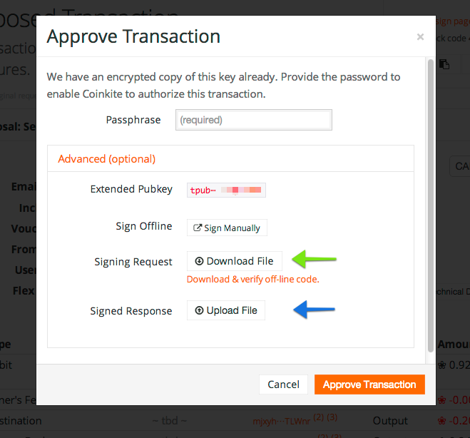

# Offline Signing Tool (python version)

This simple tool can be used to sign a proposed multisig transaction
(P2SH spend). You must already possess the associated extended public key
(BIP32 wallet). The details of the transaction to be signed can
either be fetched from Coinkite (based on a very long URL, provided
with `--url` argument) or in a file, as download from the site.

The signed output (which is a small JSON file) can be uploaded
manually, but this program will by default upload the file to
Coinkite.  If this new signature is the final one required, the
transaction is sent immediately.

This code is functionally equivalent to the standard Javascript
offline-signing code we provide at: <https://coinkite.com/offline/>

[Learn more about Coinkite's Multisig (Shared) accounts](https://coinkite.com/faq/multisig)
and visit the [Coinkite Main Site](https://coinkite.com/) to open your
account today!

# Usage



Save the file you get from pressing beside the **Green** arrow, and 
provide that as the `--proposal` argument. If you need to manually upload,
use the file saved with `--output` at the **Blue** arrow.

You must always provide a base58 encoded `xprv` key
using the `--key` argument.

````
Usage: olsign.py [OPTIONS]

Options:
  -i, --proposal FILENAME  JSON file downloaded from CK already
  -u, --url URL            https://coinkite.com/co-sign/json/<req>:<cos>:<pin_check>
  --html / --no-html       Show details of proposed transaction?
  -k, --key FILENAME       Extended private key (base58)  [required]
  --upload / --no-upload   Auto upload signed results file to CK?
  -o, --output FILENAME    Write signed response to this file
  --help                   Show this message and exit.
````

## Requirements

See also the version numbers in the `requirements.txt` file, which should
be ready to use with `pip install -r requirements.txt`.

**Important:** We require message signing features which have not yet been
accepted upstream into `pycoin` so please use
[this fork of pycoin](https://github.com/peter-conalgo/pycoin/tree/msg_signing_2)
for now:

    git://github.com/peter-conalgo/pycoin.git@msg_signing_2#egg=pycoin


## More about Coinkite

Coinkite is the world's easiest and most powerful web wallet for
safely holding all your cryptocurrencies, including Bitcoin and Litecoin.

[Learn more about all we offer](https://coinkite.com/)


